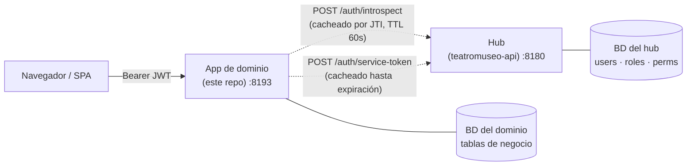
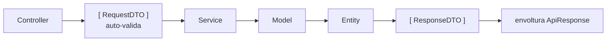

# teatromuseo-event-domain

[](https://codeigniter.com/)
[](https://www.php.net/)
[](phpstan.neon)
[](LICENSE)

> **Estado:** dominio inicial integrado en Teatro Museo — English version: [README.md](README.md)

Aplicación de dominio CodeIgniter 4 para la programación y operación de eventos de Teatro Museo. Posee su propia lógica de negocio y base de datos, pero **delega autenticación, usuarios e IAM al API central** (`teatromuseo-api`).

El código de aplicación registrado en el hub es **`event`**. El plural `events` se reserva para el namespace de recursos y las tablas de la base de datos.



Flechas sólidas = tráfico en cada request. Discontinuas = llamadas al hub, ambas cacheadas.

El reparto:

- El **hub** emite los JWT, posee las tablas `users` / `roles` / `permissions` y resuelve los permisos efectivos por `(usuario, aplicación)`.
- La **app de dominio** valida los JWT entrantes llamando a `POST /api/v1/auth/introspect` en el hub, y luego aplica los permisos localmente con el filtro `permission:<código>`.
- La app de dominio **nunca** almacena usuarios, **nunca** emite JWT ni lee la BD del hub directamente.

## Límite dentro de Teatro Museo

Este dominio posee la programación operativa, no el contenido editorial:

- `events` representa una actividad programada: función, sesión de festival, curso o taller.
- `ticket_types`, `bookings` y `tickets` entregan la capa opcional de cupos y control de acceso.
- Las descripciones editoriales y la composición de páginas permanecen en `teatromuseo-cms-domain`; las piezas museográficas permanecen en `teatromuseo-catalog-domain`.
- Los enlaces entre dominios usan identificadores o referencias, nunca claves foráneas entre bases de datos.

---

## Inicio rápido

```bash
./init.sh
# Pregunta: URL del hub, X-App-Key, código de app, credenciales de BD,
# JWT de superadmin opcional.
# Ejecuta: composer install → migrate → domain:sync-permissions.

php spark serve --port 8193
```

El puerto por defecto es **8193** para no chocar con el hub (`:8180`) ni con el admin (`:8182`).

### Coordenadas del hub requeridas

Antes de que `init.sh` pueda terminar, el hub debe tener ya:

1. Una fila en `applications` con `code = <hub.appCode>` que vas a configurar aquí.
2. Una API key vinculada a esa aplicación (`php spark apps:bootstrap <code>` en el hub).
3. *(Solo para la primera sincronización de permisos)* un JWT de superadmin — los service tokens no satisfacen `iam.superadmin-access`. Obtenlo con `POST /api/v1/auth/login` en el hub usando credenciales de superadmin.

Si falta cualquiera de los tres, `domain:sync-permissions` falla con un mensaje claro; es idempotente y se puede reintentar sin problema.

---

## Qué incluye

| Componente | Propósito |
|---|---|
| `App\Filters\DomainAuthFilter` (alias `domainauth`) | Reemplaza la validación local de JWT. Llama a `HubClient::introspect()` e inyecta `(uid, permissions[])` en el contexto de la petición. |
| `App\Libraries\Hub\HubClient` | Único punto de contacto con el hub. Cachea introspecciones (por JTI) y service tokens (refresco con margen de seguridad antes de expirar). |
| `App\Commands\SyncPermissions` (`php spark domain:sync-permissions`) | Registra los permisos de `Config\DomainPermissions` en el hub vía `POST /api/v1/iam/permissions`. Idempotente. |
| `App\Config\DomainPermissions` | Fuente de verdad declarativa para los permisos que posee esta app. |
| Override de `App\Config\Scaffolding` | `make-crud` genera rutas ya envueltas en `domainauth + permission:<código> + throttle`. |
| `App\Models\BaseAuditableModel` + trait `Auditable` | Logs de auditoría locales en la tabla `audit_logs` de esta app. |
| Hardening heredado | Cabeceras de seguridad, correlation IDs, claves de idempotencia, cabeceras de deprecación, RFC 7807, filtro de modo mantenimiento, logs en JSON, request logs / metrics / cola. |

## Qué NO incluye

Esto es una app de dominio, no el hub. Lo siguiente está **fuera de alcance** y vive en el hub:

- Tablas `users` / `roles` / `permissions` y endpoints administrativos (`/api/v1/iam/*`)
- Login, logout, reseteo de contraseña, verificación de email, Google OAuth
- Emisión y refresh de JWT
- Drivers de almacenamiento de ficheros (S3, local) — vuelve a añadirlo como módulo específico de un dominio si ese dominio lo necesita

---

## Comandos comunes

```bash
# Servidor de desarrollo
php spark serve --port 8193

# Base de datos
php spark migrate                    # Solo migraciones locales — nunca toca la BD del hub
php spark tests:prepare-db           # Sincroniza la BD de tests antes de feature tests

# Sincronización de permisos con el hub (idempotente — se puede reintentar)
php spark domain:sync-permissions --admin-token=<jwt>     # o configura hub.adminToken en .env

# Tests
vendor/bin/phpunit                   # Todos
vendor/bin/phpunit tests/Unit        # Rápido, sin BD
vendor/bin/phpunit tests/Integration # A nivel de BD
vendor/bin/phpunit tests/Feature     # Endpoints HTTP (requiere tests:prepare-db)

# Quality gates
composer quality                     # PHPStan nivel 8 + PHPUnit + cs-check
composer cs-fix                      # Auto-corrige estilo — ejecútalo antes de commitear

# OpenAPI
php spark swagger:generate
```

### Añadir un nuevo módulo CRUD

Usa el wrapper de shell (compatible con entornos no-TTY — `php spark make:crud` directo se cuelga en CI / Claude Code):

```bash
bash vendor/bin/make-crud.sh Item Example 'name:string:required|searchable,description:text' yes
php spark migrate
pkill -f 'spark serve'; php spark serve --port 8193 &     # las rutas no se recargan en caliente
php spark swagger:generate
```

El generador emite rutas ya envueltas en `domainauth + permission:items.read + throttle`. Ajusta los códigos de permiso por verbo si lectura y escritura deben divergir.

### Añadir un nuevo permiso

1. Agrégalo a `app/Config/DomainPermissions.php::PERMISSIONS`.
2. Ejecuta `php spark domain:sync-permissions` — lo registra en el hub (idempotente).
3. En el panel del hub, asigna el nuevo permiso al/los rol(es) que deban tenerlo.
4. Referencia el código en tu filtro de ruta: `permission:items.archive`.

> **El separador de permisos es `.`, nunca `:`** — el parser de filtros de CI4 divide por `:` para argumentos y trunca silenciosamente `permission:items:archive` en `permission:items`. Ver `TASKS.md` ⇒ "Architecture contracts".

---

## Configuración

Variables de entorno requeridas (ver `.env.example`):

| Variable | Propósito |
|---|---|
| `hub.url` | URL base del hub (ej. `http://localhost:8180`) |
| `hub.apiKey` | `X-App-Key` vinculado a la fila de esta app en `applications` del hub |
| `hub.appCode` | Código de aplicación tal como está registrado en el hub |
| `hub.introspectCacheTtl` | *(opcional)* TTL del cache de introspect en segundos, por defecto `60` |
| `hub.adminToken` | *(opcional)* JWT de superadmin para `domain:sync-permissions` — prefiere el flag `--admin-token` para uso puntual |
| `database.default.*` | Conexión MySQL propia de esta app |
| `encryption.key` | Clave de cifrado de CI4 (32 bytes tras decodificar `hex2bin:`) |

> **Los tokens son solo de lado servidor.** Pásalos vía cabecera `Authorization: Bearer …` (SPA) o sesión PHP (admin server-rendered). Nunca almacenes JWT en `localStorage` ni en cookies sin `HttpOnly`.

---

## Arquitectura

Pipeline en capas DTO-first, idéntico en forma al del hub:



Cada paso tiene una sola responsabilidad: `RequestDTO` valida en construcción, `Service` ejecuta lógica de negocio pura (DTO entra, DTO sale, transaccional vía `HandlesTransactions`), `Model` persiste, `Entity` es la fila, `ResponseDTO` es el contrato emitido al cliente. `ApiController::handleRequest()` orquesta sin boilerplate.

Las clases base (`ApiController`, `BaseCrudService`, `BaseRequestDTO`, `BaseAuditableModel`, la cadena de auditoría y las excepciones HTTP) se consumen desde el paquete `dcardenasl/ci4-api-core`. El dominio mantiene únicamente el código específico de programación, eventos y ticketing.

Para la arquitectura y contratos completos:

- [`docs/architecture/OVERVIEW.es.md`](docs/architecture/OVERVIEW.es.md) — capas, ciclo de petición, convenciones
- [`docs/architecture/AUTHENTICATION.es.md`](docs/architecture/AUTHENTICATION.es.md) — delegación al hub en detalle
- [`docs/template/ARCHITECTURE_CONTRACT.es.md`](docs/template/ARCHITECTURE_CONTRACT.es.md) — qué forma debe tener el código generado (SSOT)
- [`CLAUDE.md`](CLAUDE.md) — acuerdos de trabajo para agentes de código (también útil para humanos)
- [`TASKS.md`](TASKS.md) — trabajo actual y backlog

El índice completo de documentación está en [`docs/README.es.md`](docs/README.es.md).

---

## Versionado y releases

Esta plantilla sigue [Semantic Versioning](https://semver.org/). Ver [`CHANGELOG.md`](CHANGELOG.md) para los cambios entre versiones.

---

## Licencia

[MIT](LICENSE).
